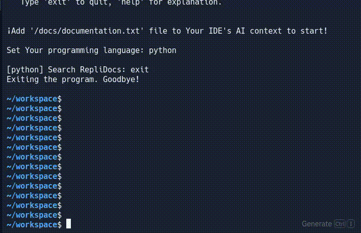

# RepliDocs 📜

RepliDocs is an automated programming documentation scraper designed for usage in Replit AI context. Created by Vertinski (oc) 2024.

## Description

This Python-based tool allows users to search for and retrieve programming documentation directly within the Replit environment. It uses free APIs to fetch and process search results, making it suitable for quick reference and integration with Replit's AI features.

## Functionality

- Set and change the target programming language
- Search for documentation using natural language queries
- Automatically retrieve and clean relevant documentation
- Store documentation in a text file for easy access by Replit's AI
- Simple command-line interface for ease of use

## Commands

- `lang <language>`: Change the target programming language
- `clear`: Clear the stored documentation
- `buff <int>`: Set the document count in the buffer
- `help`: Display available commands and usage information
- `exit`: Quit the program

## Limitations and Potential Improvements

1. **API Constraints**: The program uses free APIs, which may have limitations on request volume and response size.
   - *Mitigation*: Implement paid API services for improved performance and larger context limits.

2. **Context Size**: Replit's AI context size is limited, restricting the amount of documentation that can be stored.

3. **Result Cleaning**: The current version has limited ability to clean and format retrieved documentation.
   - *Mitigation*: Enhance the cleaning function using paid AI services.

## Setup

1. Set up your Groq API key in the Replit environment variables.
2. Run the script in terminal, it automatically installs or updates modules (`duckduckgo-search`, `groq`).
3. Add '/docs/documentation.txt' file to Your IDE's AI context.
4. Use the prompt to search for documentation -- results are automatically added to Replit AI context.

## Note

This tool is designed specifically for use within the Replit environment and may require adjustments for use in other contexts.
